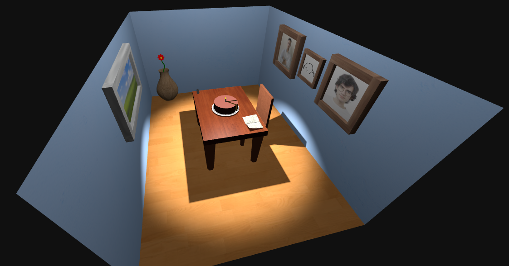
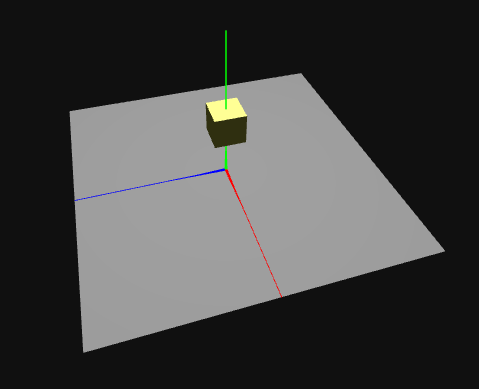

# SGI 2023/2024 - TP1

## Group: T08G09

| Name             | Number    | E-Mail             |
| ---------------- | --------- | ------------------ |
| Diogo Silva         | 202004288 | up202004288@up.pt   |
| Tomás Pires         | 202008319 | up202008319@up.pt   |

----

## Project information

- All items in the scene can be toggled on or off, with parent items being disabled as well.
- A chair is included as an extra element in the scene.
- Some extra textures were added as well.
- The flower stem was initially just a curved line, but in order to improve even more its realistic aspect, the THREE.TubeGeometry was used together with the CatmullRom curve definition.
- Scene
  - A simple depiction of a room, containing a birthday cake sitting atop a table, a chair, two framed photos and a framed drawing of a Beetle car, a window, a jar with a flower inside and a light source sitting above the cake.
  - [Main page for this scene lies here.](index.html)

----

### Illumination

**Change the position of the light source from (0, 20, 0) to (0, -20, 0). Comment on the lighting changes found, namely:**
- **On the plane object**
    - Turns very dark, as the point light no longer illuminates the visible side. 
- **on the top face of the cube**
    - Turns very dark, as the point light is now directly below the cube.
- **on the side faces of the cube**
    - Side faces of cube: stay the same, because the point light is either directly above or below, hitting "parallel" to these sides.

**Change the intensity of the light source to 5 and its position to (0, 2, 0); repeat the previous points.**
- **On the plane object**
    - Is slightly illuminated, as the point light is above it but with low intensity.
- **on the top face of the cube**
    - Is very dark, as the point light is now inside the cube and doesn't hit the external visible sides.
- **on the side faces of the cube**
    - Is very dark, as the point light is now inside the cube and doesn't hit the external visible sides.

**Modify: this.diffusePlaneColor = "rgb(0,0,0)"**
- **What lighting component(s) do you find in the plan?**
    - Just specular component.

**Also modify: this.planeShininess = 400**
- **What differences do you find? (try other values…)**
    - The light reflexion is more intensely focused on a smaller area.

**Modify it now (note there is one more parameter inPointLight):**
- **this.diffusePlaneColor =  "rgb(128,128,128)"**
- **this.specularPlaneColor = "rgb(0,0,0)"**
- **this.planeShininess = 0**
- **...**
- 
- **pointLight = new THREE.PointLight(0xffffff, 5, 0, 0);**
- **pointLight.position.set( 0, 20, 0 );**
- **See and memorize the result**

**Modify: pointLight = new THREE.PointLight(0xffffff, 5, 15, 0)**
- **Comment on the changes observed.**
    - The objects just became much darker (less lighting).
- **Reset the penultimate parameter to 0 (intensity) and vary the last parameter between 0, 1 and 2 (decay); comment on the results.**
    - As the number increases, the objects receive less and less lighting.

**Check the effect of changing the second parameter of the constructor DirectionalLight(...), relative to its intensity and measured in candelas (cd).**
- The higher that value, the more intense the directional light gets.

**Change the position of the light source to(5, 10, 2). Comment on the new lighting obtained.**
- From the default perspective, the portion of the cube facing us is more illuminated relative to the other portion.

**Change the position of the light source to(-5, 10, -2). Comment on the new illumination obtained.**
- From the default perspective, the portion of the cube facing us is less illuminated relative to the other portion.

**Interpret in as much detail as possible the handler and the effect of its position on the lighting of the plane.**
- The spot light handler has a cone shape structure and the portion of the plane inside the cone is illuminated. Also, the closer the distance of an object inside the cone to its top vertex, the more light it gets.

**Compare, on the 3 illuminated sides of the cube, the respective illumination.**
- The top side gets the most light (closer to cone top vertex), followed by the front side and finally the lateral side.

**Change the spot angle to 35º**
- **Compare, on the 3 illuminated sides of the cube, the respective lighting.**
    - The ligth cone got larger, but the sides of the cube are pratically illuminated as before.

**Change the penumbra value to 0.2 (meaning 20%)**
- **Check the effect of this change on the plane and cube lighting**
    - The cube lighting doesn't change (still inside the cone and centered) but the margins of the light hitting the plane make a transition, basically degrading (penumbra effect).

----

### Textures

**Run the program (adjust the light source if necessary) and check:**
- **The colors of the plan image.**
- **Change the material's diffuse color from gray to red: this.diffusePlaneColor =  "rgb(128,0,0)"**
- **Comment on the change in colors of the image on the plane... the "mixing" of the material color with the texture colors seems to be evident!**
    - The texture is visible on the plane, but the general color is red.

**Comment now the code marked with "Alternative 1" and uncomment the code marked with "Alternative 2".**
- **What consequences does this have for the image? (colors…)**
    - The image now has no defined color, simply the colors that come with the texture.

**Analyze the result obtained, now in terms of polygon and texture dimensions.**
- **Does the texture image appear entirely on the plane?**
    - Yes.
- **Does the original length/width ratio of the texture in the image appear to be maintained?**
    - No, it seems horizontally stretched.
- **Change now: let planeSizeU = 10; let planeSizeV = 3;**
- **The polygon was reduced in one dimension; repeat the previous points.**
    - The image does not appear entirely on the plane but the length/width ratio was maintained.
- **Interpret the result obtained based on the line of code: let planeTextureRepeatV = planeTextureRepeatU * planeUVRate * planeTextureUVRate;**
    - The formula obtains the number of times the texture should be repeated in the vertical direction; planeTextureRepeatU is repetition in the horizontal direction (1, as seen in the plane); planeUVRate is the aspect ratio in the UV space; planeTextureUVRate is the ratio of image dimensions.
- **Make again planeSizeV = 7 and change planeTextureRepeatU = 2.5**
- **Check texture "repeat" in both directions**
- **Check that, in each replica of the texture image, the length/width ratio is maintained. Justify...**
    - The texture is replicated in the horizontal direction 2.5 times, and the length/width ratio is not maintained, it is changed for that repetition to occur.
- **Modify: this.planeTexture.wrapS = THREE.ClampToEdgeWrapping; this.planeTexture.wrapT = THREE.ClampToEdgeWrapping;**
- **Interpret the result by comparing it with the previous situation.**
    - With clamp to edge, there is a single replica of the texture and at the margins, the texture is "extended" to fill the plane. So there are no repetitions but the length/width ratio is the same as a complete replica before (not maintained, planeTextureRepeatU is 2.5).
- **Modify: this.planeTexture.wrapS = THREE.MirroredRepeatWrapping; this.planeTexture.wrapT = THREE.MirroredRepeatWrapping;**
- **Interpret the result by comparing it with the previous situation.**
    - The result is the same as with repeat wrapping, but at each repetition a replica is mirrored in relation to the one next to it.

**Modify: this.planeTexture.rotation = 30 * Math.PI / 180;**
- **Comment on the result obtained; experiment with other rotation values.**
    - The texture is rotated in relation to the plane, so the space left from the rotation is filled with replicas because of RepeatWrapping.

----

### Curves

**Run the program and check the result obtained; is drawn in white polyline consisting of two straight segments and three vertices**
- **What does this line correspond to?**
    - This polygonal line defined by 3 points constitutes the convex hull.
**Interpret the last lines of the QuadraticBezierCurve function that are commented:**
- **Definition of convex hull**
    - let curve = new THREE.QuadraticBezierCurve3(points[0], points[1], points[2])
- **Curve sampling**
    - let sampledPoints = curve.getPoints(this.numberOfSamples);
    - this.curveGeometry = new THREE.BufferGeometry().setFromPoints(sampledPoints)
- **Conversion to geometry, with a green material**
    - this.lineMaterial = new THREE.LineBasicMaterial({ color: 0x00ff00 })
    - this.lineObj = new THREE.Line(this.curveGeometry, this.lineMaterial)
- **Drawing of the curve, with the convex hull centered at the origin of the coordinates**
    - this.lineObj.position.set(position.x, position.y, position.z)
    - this.app.scene.add(this.lineObj);

**Run the program**
- **Reduce the number of samples to 4 and comment on the shape obtained**
    - In the CatmullRomCurve, changing the samples to 4 results in a sequence of straight lines, as the number of points for the curve is higher than the samples.
- **Increase the number of samples to 5… 7… 10… 16**
    - **What do you conclude about the influence or not of the number of points over the number of samples?**
        - With a higher number of samples in relation to points, more curving effect is obtained.

**Interpret the call to this.builder.build()**
    - This call constructs a NURBS surface using control points (with positions and weights), orders U and V (U and V directions degrees), samples U and V (determines the detail/resolution in each direction) and the material applied.

**Vary the number of samples in both directions; 3 … 4 … 6 … 8 … 12 … 16 … 24 …**
- **Can you observe changes?**
    - No (1st nurb).

**Results analysis**
- **What is the degree in U? Is a V?**
    - orderU = 2; orderV = 1;
- **Vary the number of samples in both directions; 3 … 4 … 6 … 8 … 12 … 16 … 24 …**
    **What changes do you notice?**
        - The higher the number of samples, the more curving effect (resolution) we get.
    **Why the difference in behavior, if any, in the case of a flat rectangle surface?**
        - In the flat surface, sample manipulation has no visible effects because there are no curve portions to apply detail on.
- **Increase the weight of the last given point to 10**
    - **What will be the affected vertex on the surface?**
        - The vertex on the top right corner of the surface.

----

### Shadows

**Reduce the shadow map resolution from 4096 to 1024.**
- **Comment on the quality of the two shadows mentioned (zoom in to see in detail)**
    - The quality of the 2 shadows got worse (less detail on the borders).

**Increase the number of rectangles drawn in the mentioned volume to 100**
- **Comment on the existence of shadows projected from some rectangles onto others**
    - The phenomenon does occur.
- **Comment on the existence of shadows projected on the floor by the rectangles between it and the light source**
    - The phenomenon does occur.
- **Comment on the existence of a shadow projection by the plane (the floor) in the rectangles that are below it**
    - This is not noticed.

**Reverse the direction of rotation in x of the plane, so that its visible face is oriented downwards**
- **Comment on visibility and floor lighting**
    - The floor is not visible from the default perspective (above).
- **Comment again on the existence of a shadow projected by the plane in the lower rectangles**
    - Now, the shadow projected by the plane is indeed visible in the lower rectangles.
- **What conclusion do you take?**
    - Now, the plane is perpendicular to the direction of the light source, and can cast shadows on objects below it because it blocks the path of the light rays.

**Replace the floor plane with a box of the same dimensions x and z, but very thin in y (30 * 0.1 * 30).**
- **Re-evaluating the previous shadows: do you think the problem is resolved?**
    - Yes.

**Change, in the directional light camera, the values ​​shadow.camera.left / right / bottom / top to -3, 3, -3, 3 respectively**
- **What conclusion do you draw? (You may get more conclusive images with a higher number of polygons, perhaps 250)**
    - The total area the shadow covers appears smaller.

**Change now, in the same camera, shadow.camera.far = 27**
- **What conclusion do you draw? (you may get more conclusive images with the original shadow.camera.left/right/bottom/top values)**
    - The depth range over which shadows are casted was reduced. Basically, the directional light is not able to cast shadows on objects located at greater distances from the light source.

**Gradually increase the number of rectangles and check the FPS values**
- **With how many polygons does the FPS value drop to around 40?**
    - 2000.
- **With how many polygons does the FPS value drop to around 20?**
    - 1000.

----

## Issues/Problems

- So far we have not encountered any problems in this release.
