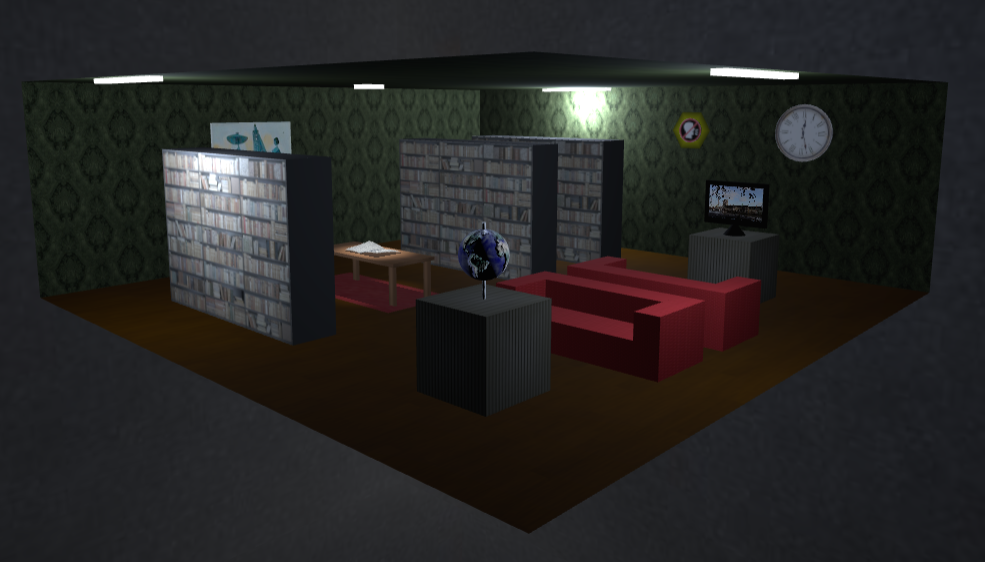

# SGI 2023/2024 - TP2

## Group: T08G09

| Name             | Number    | E-Mail             |
| ---------------- | --------- | ------------------ |
| Diogo Silva         | 202004288 | up202004288@up.pt   |
| Tomás Pires         | 202008319 | up202008319@up.pt   |

----

## Project information

- [Main page for this scene lies here.](index.html)
- The scene consists of a library room (inside a skybox), with floor, roof and 2 walls containing a painting, a clock and a silence warning. There is also a table with a newspaper, surrounded by some bookshelves. Additionally, a globe and a TV are visible, with some couches between them.
- The scene graph is configured following a bottom-up logic, processing each node and building the THREEjs objects from the primitives to the upper groups.
- Materials are built independently for each mesh to which they are applied, to avoid configurations from different contexts to a material that's being shared. Textures use the same logic.
- Different levels of detail are applied to the clock and the bookshelves.
- There are some advanced textures in cases like the skybox, the painting with mip-maps, the globe with a bump texture and also the TV with a video texture.
- The stick supporting the globe has the wireframe property on.
- The silence warning in the wall uses a polygon (buffer geometry) for its shape.
- The interface offers control over different cameras, the available lights and all the groups of objects in the scene.
- In terms of creativity, the scene tries to truly resemble the environment of a library room, having a moderate degree of illumination, a newspaper built using nurbs with a spot light above (and shadows), and the silence sign which makes sense in this context.
- The code is well structured, being divided into different files and functions. Also, code documentation is available. 

----
